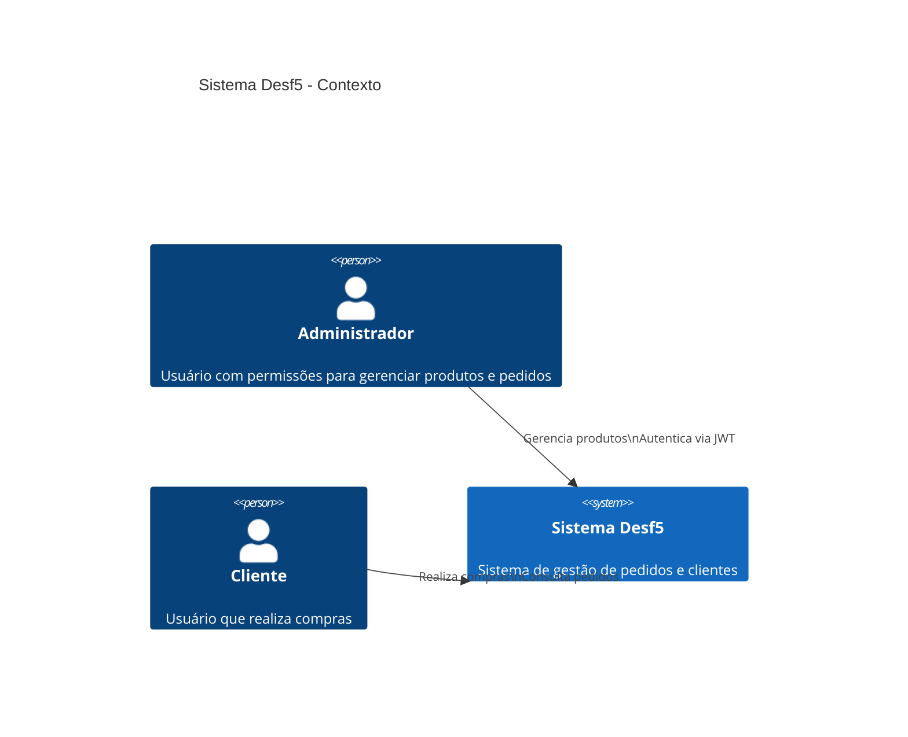
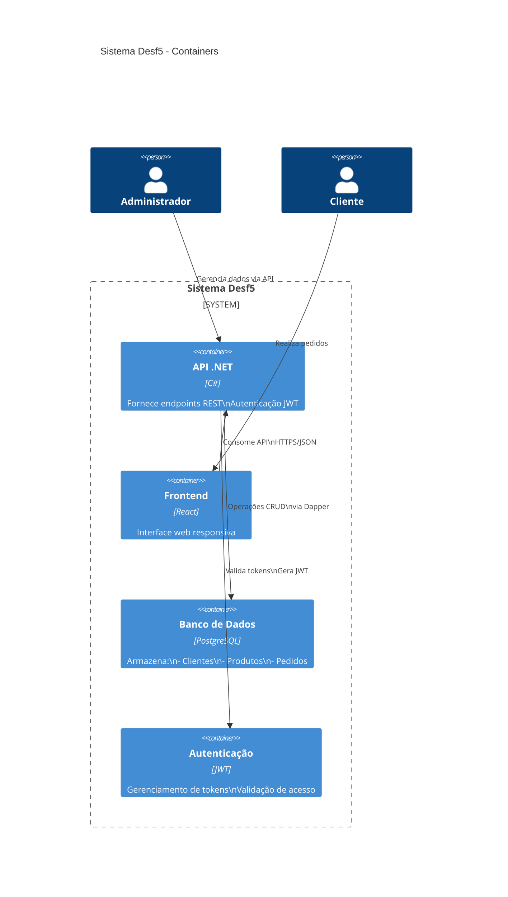
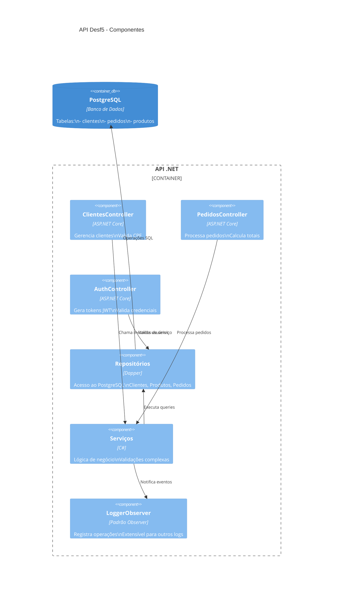
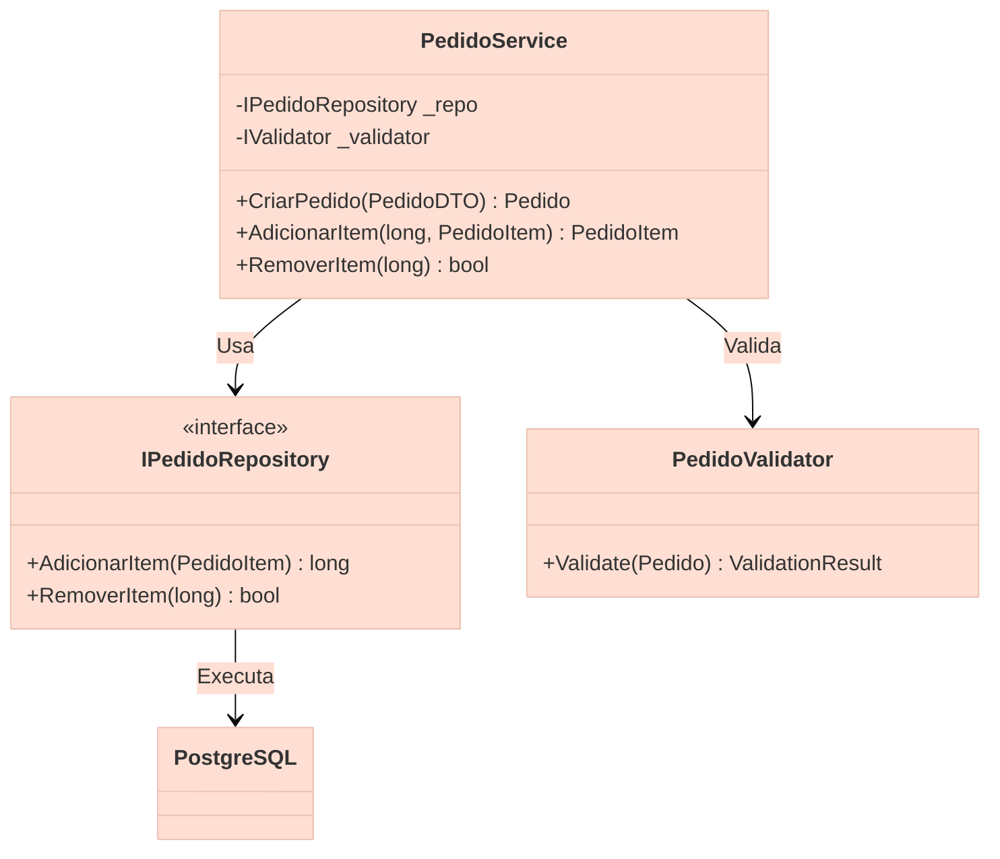
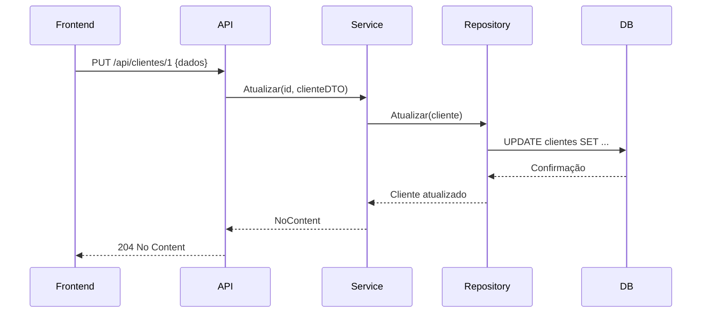

# Arquitetura do Sistema Desf5

### 1. Diagrama de Contexto (Nível 1)

### 2. Diagrama de Container (Nível 2)

### 3. Diagrama de Componentes (Nível 3)

### 4. Diagrama de Código (Nível 4 - Exemplo PedidoService)

### 4. Diagrama de Sequência da atualização de Cliente
